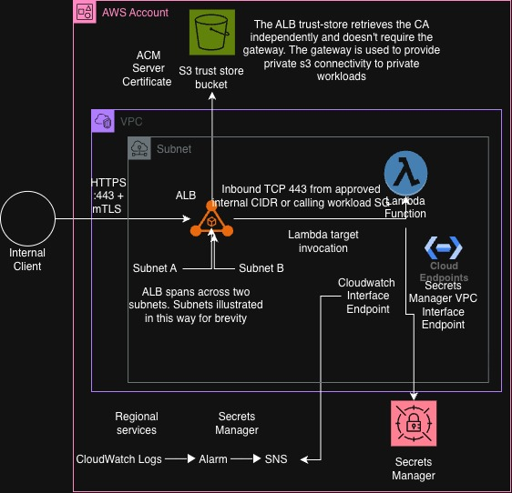

# checkout-cloud-platform-assessment

# Documentation referenced 

[MTLS API Gateway Lambda](https://docs.aws.amazon.com/apigateway/latest/developerguide/rest-api-mutual-tls.html)

"By default, clients can invoke your API by using the execute-api endpoint that API Gateway 
generates for your API. To ensure that clients can access your API only by using a custom domain 
name with mutual TLS, disable the default execute-api endpoint. To learn more, 
see Disable the default endpoint for REST APIs."

Contrary to what the task asks from me, execute-api would bypass the MTLS requirement, 
so I will disable it. mTLS is associated with a custom domain name, so I will create a custom domain name and 
associate it with the API Gateway.

# Infrastructure Diagram



(Previous version is still available in images/)

# Design Choices and Alternatives Rejected

The full research trail (with citations) behind these lives in `docs/decision-log.md`. This is
the condensed version: the decision, the alternative rejected, and why.

## API layer: internal ALB, not private API Gateway

mTLS isn't supported on private API Gateway endpoints at all - confirmed directly in AWS's docs,
not inferred. An ALB supports mTLS natively via a trust store on the listener. Once execute-api
was ruled out as a bypass path (it isn't associated with the trust store, only a custom domain
is), a private REST API couldn't satisfy the mTLS requirement under any configuration. The ALB
is doing ingress/security work here, not compute scaling - Lambda scales and can sit behind an
ALB target group without needing one for either reason.

## Lambda is VPC-attached, despite not needing to be

Lambda doesn't require a VPC to scale, and doesn't need one to sit behind an ALB target group
either. It's attached anyway, deliberately, so its calls to Secrets Manager, CloudWatch Logs, and
SSM Parameter Store stay off the public internet via interface endpoints, rather than because
anything technically forces it.

## Certificate storage: split by consumer, not one blanket choice

- CA private key and the test client cert/key -> Secrets Manager, because neither is consumed by
  an AWS service that natively imports or holds certificate material.
- Server certificate -> signed by the CA, then imported into ACM, because ACM is the actual
  consumer (the ALB listener references it by ARN).
- Rejected: automated Secrets Manager rotation. Secrets Manager has no built-in rotation for
  arbitrary certificate material (unlike RDS) - it needs a custom rotation Lambda, which was
  disproportionate to build for this assessment. Documented as a known gap, not implemented.
- Note: importing into ACM does **not** avoid the "private key in Terraform state" problem -
  `private_key = tls_private_key.server.private_key_pem` still writes the plaintext key into
  state. Only AWS Private CA (where AWS generates and holds the key entirely within its own
  service boundary, never handed to Terraform) actually avoids that.

## No S3 Gateway endpoint, despite the brief requiring one

The brief states one is required regardless of a demonstrated consumer. Rejected anyway: no
workload in this design privately calls S3 (the ALB's trust-store fetch happens via the ELB
control plane, entirely outside the VPC's routing - a gateway endpoint can't intercept traffic
that never touches your route tables in the first place). Adding infrastructure with no consumer
just to satisfy a checklist line was rejected in favour of a documented, deliberate deviation.

## Interface VPC endpoints written as real Terraform resources, not left as design-only

The brief allows a documented-design-only alternative given interface endpoints aren't free
tier. Chose to define them as actual `aws_vpc_endpoint` resources anyway (Secrets Manager,
CloudWatch Logs, SSM), rather than only describing the design - demonstrating the real pattern
was worth writing, even though (see Gaps and Follow-ups) none of this has actually been applied
to a live AWS account, so no cost has actually been incurred and nothing is currently running.

## No NACLs beyond the default allow-all

Rejected as unnecessary here: a single private subnet tier shared by the ALB, Lambda, and the
VPC endpoints has no distinct trust boundary for a NACL to enforce, and NACLs are stateless -
replicating the same least-privilege rules at that layer would mean also hand-writing
ephemeral-port return-traffic rules, for no additional real security over the stateful security
groups already in place. Would use NACLs as a coarse, subnet-wide guardrail if there were a
genuine separate trust zone to wall off - e.g. a public subnet sitting next to this private one -
which doesn't apply to this fully-private, single-tier design.

## OIDC trust scoped by GitHub Environment, not branch

The brief asks specifically how you'd scope the trust condition to repository and branch.
Considered and rejected in favour of environment-based scoping
(`repo:<owner>@<id>/<repo>@<id>:environment:<dev|nonprod|prod>`), because it ties directly to the
approval-gate structure already in place (GitHub Environment required-reviewer rules on
`nonprod`/`prod`) - a branch-based condition doesn't map onto that gating the same way. Branch
scoping (`...:ref:refs/heads/main`) would be the right choice if the promotion model were purely
branch-driven instead of environment-driven.

## IAM/OIDC resources scoped per Terraform workspace, not `for_each` across all three

IAM roles and the OIDC provider are account-global resources, not scoped per Terraform state. A
`for_each` over `["dev", "nonprod", "prod"]` in one state would mean every workspace's apply tries
to create the same three roles - a collision the moment a second workspace is applied. Keyed
everything off `terraform.workspace` instead (one role/provider per account), consistent with a
one-AWS-account-per-environment topology.

## Environment separation: Terraform workspaces, not directory-per-environment

My original repo structure planned a directory-based layout (an `environments/` folder per
environment, each with its own state). I built workspaces instead, part-way through, specifically
to move faster within this assessment's time-box - the actual difference between environments
here is small (CIDR ranges, a domain name, ALB ingress sources), and workspaces let me keep that
difference in one place (`locals.tf`'s workspace-keyed maps) rather than restructuring into
separate root modules mid-build. That's a deliberate, time-boxed trade-off, not a claim that
workspaces are the better choice generally.

For a regulated estate, I would use the directory-based structure I originally planned, not
workspaces: workspaces sharing one codebase make it easy for a change intended for `dev` to
silently apply cleanly to `prod` too, since there's no code-level barrier between them - only the
human discipline of picking the right workspace. Separate directories (or separate root modules
entirely, one per account) make that mistake structurally harder to make, at the cost of some
duplication. Converting this build to that structure would mean moving the ~50 references to
`terraform.workspace` across 10 of the 12 `.tf` files into a shared module parameterised by
`var.environment`, with a root config and backend per environment - a real refactor, which is why
it's documented here rather than done under the remaining time for this assessment.

# Encryption and Key Management

Before writing any of the encryption-related resources, I'd already researched the difference
between AWS-owned keys, AWS-managed keys, and customer-managed KMS keys, and the cost/overhead
trade-off between them - this wasn't something I worked out mid-build, it informed the design
from the start.

- **S3 (trust-store bucket and ALB access-logs bucket)**: SSE-S3 (`AES256`). This uses an
  AWS-owned key - it never appears in the account's KMS console, there's no monthly fee, and
  critically there's no per-request KMS API charge either, because the encryption happens
  entirely inside the S3 service rather than through a customer-facing KMS call. For buckets that
  don't need custom key policies, cross-account grants, or independent audit/rotation control,
  this is strictly less overhead than SSE-KMS for the same practical protection.
- **Secrets Manager (CA private key, test client certificate)**: the default AWS-managed key
  (`aws/secretsmanager`), i.e. no `kms_key_id` specified. Secrets Manager has no AWS-owned-key
  tier the way S3 does - every secret is encrypted through KMS one way or another - so the
  AWS-managed key is the lowest-overhead option actually available for this service. It still
  costs nothing per month; only the customer-managed tier adds the ~$1/month/key charge.
- **CloudWatch Logs**: left on AWS's default encryption at rest, no explicit KMS key configured.

Net effect: this build provisions **no customer-managed KMS key**. That's a deliberate decision,
not an oversight - nothing here needs a custom key policy, cross-account key sharing, or
independent key rotation scheduling at this stage. I would introduce a customer-managed key if a
future requirement needed one of those specifically (e.g. sharing decrypt access with another
account, or an audit requirement for customer-controlled rotation), and would scope its key
policy narrowly to the principals that actually need it rather than defaulting to broad access.

# Setup, Deployment, and Teardown

## Prerequisites

- Terraform >= 1.10.0, [Task](https://taskfile.dev) (`go-task`), Python >= 3.13.
- An AWS credential with enough privilege to bootstrap the account (see below) - day-to-day
  local usage should use a role scoped to least privilege, not this bootstrap credential.

## One-time account bootstrap (chicken-and-egg problem)

Two things in this design can't be created by the pipeline that depends on them, so they must be
created once, out-of-band, before the first `terraform apply` in a given account:

1. **The Terraform state bucket** referenced in `terraform/terraform.tf` (`backend "s3"`) doesn't
   exist yet - it must be created manually (versioned, encrypted) before `terraform init` will
   succeed. State locking uses S3's native `use_lockfile` support, so no separate DynamoDB table
   is needed.
2. **The GitHub Actions OIDC provider and deploy role** (`terraform/oidc.tf`) can't be assumed by
   a CI run to create themselves. The first `terraform apply` per account has to run under a
   human/admin credential, not the CI role. After that first apply, set the resulting
   `github_actions_role_arn` output as the `AWS_ROLE_ARN` variable on that environment's GitHub
   Environment, and CI can take over from there.

## Local workflow

All commands go through the Taskfile so local runs and CI stay identical:

```
task tf:plan ENV=dev
task tf:apply ENV=dev
task py:test
task py:lint
```

`ENV` defaults to `dev` and is validated against `dev`/`nonprod`/`prod`.

## CI/CD workflow

- Merging to `main` deploys to `dev` first - no approval gate, this is the lowest-risk
  environment - then `nonprod`, then `prod`, in sequence. `nonprod` and `prod` each only proceed
  if the corresponding GitHub Environment has a required-reviewer approve it. That protection
  rule has to be configured in the repo's Settings -> Environments; it isn't something a workflow
  YAML file can declare on its own.
- Opening a pull request runs a `plan` against `dev` for a quick sanity check, without applying
  anything.
- There's a single trunk (`main`) - no separate long-lived `dev` branch.

## Teardown

```
task tf:destroy ENV=dev
task tf:destroy ENV=nonprod
task tf:destroy ENV=prod
```

Both S3 buckets (`trust_store`, `alb_access_logs`) are created with `force_destroy = true`
specifically so `terraform destroy` can remove them even with objects still inside (the CA
bundle, and any accumulated ALB access-log files) - without it, destroy would fail on a
non-empty bucket and need a manual empty-then-delete step first.

# Assumptions

- **One AWS account per environment** (dev/nonprod/prod each separate) - the OIDC provider/role
  design (`terraform/oidc.tf`) is built around this; a shared account across environments would
  need that part rethought (see Design Choices).
- **Placeholder Terraform state backend bucket** (`terraform/terraform.tf`) - doesn't exist yet,
  must be created and the name replaced before `terraform init` will work.
- **Placeholder S3 bucket names** for the trust store and ALB access logs
  (`certificates.tf`, `observability.tf`) - marked `TODO` in the code, need confirming as
  globally-unique real names.
- **Placeholder VPC CIDR ranges per environment** (`locals.tf`) - arbitrary `/16`s, not derived
  from any real IPAM plan.
- **Placeholder internal ALB domain name** (`checkout-api.<env>.internal.example.com`) - not a
  real, resolvable hostname.
- **Empty-by-default ALB ingress variables** (`alb_allowed_ingress_cidrs`,
  `alb_allowed_ingress_security_group_ids`) - no real "approved internal CIDR" or calling
  workload exists yet to populate these with; until they're set, the ALB has no ingress rules at
  all.

# Estimated AWS Costs

Nothing in this repository has been applied to a real AWS account - see Gaps and Follow-ups.
These are estimated monthly costs *if* it were applied, for a single, lightly-used environment,
using current public AWS pricing (region assumed eu-west-1; LCU/data-processing figures are
usage-dependent estimates, not fixed prices):

| Item | Estimated monthly cost | Notes |
|---|---|---|
| 3x VPC interface endpoints (Secrets Manager, CloudWatch Logs, SSM), 2 AZs each | ~$44 | $0.01/AZ/hour x 6 AZ-endpoints x ~730 hours, **not free tier**. Plus a small per-GB data-processing charge. |
| Internal ALB | ~$16 base + usage | $0.0225/hour base, plus $0.008/LCU-hour - low for a lightly-used internal API, but usage-dependent, **not free tier**. |
| Secrets Manager (CA key, test client cert) | ~$0.80 | $0.40/secret/month x 2 secrets, **not free tier**. |
| CloudWatch Logs (Lambda log group) | ~$1 or less | Usage-dependent; low at this traffic volume. |
| S3 (trust store + ALB access logs) | Negligible (cents) | SSE-S3, no KMS charges; tiny object volumes. |
| SNS (alarm topic, no subscription) | ~$0 | Negligible at this scale. |
| **Total, one environment** | **~$60-70/month** | Excludes one-time/setup costs. |

**Explicitly avoided costs**, called out because they're common line items other designs would
have: **no NAT Gateway** (~$0.045/hour plus per-GB data processing - avoided entirely by the
fully-private, endpoint-based design), **no customer-managed KMS key** (~$1/month/key - see
Encryption and Key Management for why).

**Not costed because not built**: AWS Private CA (see Gaps and Follow-ups) would add **$400/month
per CA** (general-purpose mode) plus $0.75/certificate for the first 1,000 issued per month - a
large fixed cost jump from the current $0 self-signed CA.

# Gaps and Follow-ups

**Nothing in this repository has been applied to a real AWS account.** Only `terraform fmt
-check`, `terraform validate`, and `tflint` have been run successfully. The CI pipeline's
plan/apply steps currently fail at the AWS-credentials step, because no state backend bucket or
OIDC role exists in any real account yet (see the bootstrap chicken-and-egg problem under Setup).
Anyone checking the Actions tab will see failed runs, not successful deployments - that's
expected, not a hidden problem.

- **Least-privilege IAM policy for the GitHub Actions deploy role.** Constraint: building a
  properly scoped policy for everything this stack manages (EC2/networking, ELB, Lambda,
  `iam:PassRole` scoped to the Lambda execution role, S3, Secrets Manager, SSM, ACM, CloudWatch,
  SNS) was more work than remaining time allowed. Chose instead: `AdministratorAccess` as an
  explicit, marked placeholder (`terraform/oidc.tf`), not a finished answer. Production version:
  a customer-managed IAM policy scoped to exactly those services/actions, no wildcards on
  resources where an ARN can be specified.
- **No automated Secrets Manager rotation.** Constraint: Secrets Manager has no built-in rotation
  for arbitrary certificate material (unlike RDS) - it requires a custom rotation Lambda.
  Chose instead: manual rotation procedure, undocumented beyond this note. Production version: a
  rotation Lambda that re-signs a new cert from the CA and updates the secret on a schedule, or
  moving key generation to AWS Private CA where AWS handles this natively.
- **No security/policy scanner in CI** (tfsec, Checkov, or Conftest/OPA) - `tflint` (general
  Terraform linting) is wired into CI, but a security-focused policy scanner is not. Would gate a
  merge on: security groups open to `0.0.0.0/0`, and IAM policies with wildcard **actions**
  (violates least privilege directly). Would only warn on: IAM policies with wildcard
  **resources** (sometimes unavoidable, e.g. for actions with no resource-level permissions),
  incomplete resource tags, and missing variable descriptions.
- **No WAF.** This is an internal-only API with no public entry point for a WAF to sit in front
  of - the ALB is internal-scheme with no IGW/NAT, and access is already gated by mTLS and
  security groups. WAF's value (filtering public HTTP traffic for common web exploits) doesn't
  apply to a network path that was never internet-reachable in the first place.
- **Central/multi-account log aggregation not implemented.** Would use CloudWatch Logs data
  centralisation (cross-account log delivery to a central logging account) if building this out
  further - it only applies to logs generated after it's configured, not historic ones, which
  fits a newly-stood-up system like this rather than one with years of existing log history to
  migrate.
- **No AWS Private CA.** The self-signed CA (via the `tls` provider) avoids any cost, per the
  assessment's explicit constraint on not purchasing real certs. In production, I'd use AWS
  Private CA instead specifically because it avoids the Terraform-state private-key exposure
  problem entirely (AWS generates and holds the key, it's never handed to Terraform) - at a real
  cost of $400/month per CA (general-purpose mode) plus $0.75/certificate for the first 1,000
  issued per month, versus $0 for the current approach.
- **No Terraform tests** (`.tftest.hcl` files) - the Taskfile has a `tf:test` task wired up, but
  no test files exist yet for it to run.
- **No reusable Terraform module structure, Lambda versioning/aliases with a canary deployment
  strategy, or VPC Flow Logs/Route 53 Resolver query logging** - none of the optional stretch
  goals beyond environment separation and X-Ray tracing (both already covered above) were
  attempted, given the time already spent on the core requirements.

# AI Usage and Critique

I created the architecture, the diagram above, the repo structure, and the technical decision
log first. Claude was then used only to accelerate implementation, prompted one Terraform/Python
file at a time, with each suggestion reviewed against my intended architecture and AWS
documentation before being accepted. I did not let it design the system; I directed it file by
file and rejected or corrected anything that didn't match a decision I'd already made or
contradicted the brief.

## Representative prompts

- "Start by telling me which file you think we should implement first and why. Do not generate
  multiple files at once."
- One-file-at-a-time direction throughout (e.g. "Let's go with variables.tf", "Let's go with
  network.tf", "Let's go to security.tf now") - I controlled build order, not the assistant.
- "I would prefer the project name to be part of the locals.tf. This would be used across
  environments, so we don't need to pass this in as a variable" - correcting a variable/local
  split I disagreed with.
- Pasting the actual assessment brief text mid-build to force a check of earlier assumptions
  against the real grading criteria, which surfaced at least one direct contradiction (see below).
- "Even though the brief says to add this gateway endpoint, I don't think we should, as it isn't
  in use, and I don't want to create unnecessary infra" - explicit pushback against blindly
  satisfying a brief line where I judged it added no real value.
- "Is any of my Python code used in the upstix api relevant to how we use powertools here for
  tracing and logs?" - pointing the assistant at my own existing code so new code matched my
  established style instead of inventing a different one.
- "On line 41, you can set default values in a .get method e.g. .get('body', {})" - a direct
  code-style correction.
- Told it explicitly that decision rationale must never be written into code comments - all
  reasoning had to be surfaced to me in chat so it landed in this document, in my own words,
  since I'm the one who has to defend it in interview.
- "I want to use a pyproject.toml rather than a requirements.txt." - a packaging preference,
  asked separately from the gating request below rather than bundled in.
- "I want a gate between dev, nonprod, and prod. So when dev is merged into main, someone has to
  approve to go to nonprod, and then the same from nonprod to prod."
- "Why are we using unittest and not pytest?" - queried a design choice rather than accepting it;
  the answer was that `unittest.mock` is just the standard library's mocking toolkit used from
  inside pytest-style tests, not `unittest.TestCase` - but I asked rather than assumed either way.
- "Let's add some unit tests for Python."
- "Let's also add some sensible outputs."
- "Can you also add the KMS decision to the README.md, explicitly stating that I had researched
  AWS-owned keys and the tradeoffs beforehand."
- "Can you add number 9 [setup/deployment/teardown instructions] to the README.md as well."
- "There is one correction I want to make. Merging to main should deploy to dev. Then we have
  gates for nonprod and prod. You'll be able to see this in
  ~/_git/<my_repo that I referenced>" - corrected the promotion flow by pointing at an
  existing real workflow of mine, rather than accepting the assistant's first structure.

## Critique of the output

- **Over-permissive IAM, caught but not yet fixed**: the GitHub Actions OIDC deploy role
  (`terraform/oidc.tf`) was attached to `AdministratorAccess` as a placeholder, with only a
  `TODO` comment noting it should be scoped down. That's exactly the kind of over-permissive
  default an assistant reaches for under time pressure, and it needs replacing with a policy
  scoped to the specific services this stack manages before this could go anywhere near a real
  account.
- **Unverified/incorrect specifics in an earlier draft**: `lambda.tf` already contained a
  `python3.14` runtime and a hardcoded Powertools Lambda layer ARN before this pass. Neither was
  safe to trust as-is - `python3.14` support requires an AWS provider version we weren't pinned
  to, and the specific layer ARN/version was unverifiable without checking AWS's docs directly.
  I had it verify both against live sources rather than accept them, and switched the layer
  reference to a dynamic SSM parameter lookup instead of a hardcoded ARN so it can't silently go
  stale.
- **No public endpoint was ever proposed** - the ALB stayed internal-scheme with no IGW/NAT
  throughout, which I verified rather than assumed.
- **Non-standard branching pattern suggested**: the first version of the promotion pipeline
  invented a separate long-lived `dev` branch that auto-deployed on push, with `main` only
  handling `nonprod`/`prod`. That's not how I actually work - a single trunk (`main`) with
  `dev`/`nonprod`/`prod` promoted in sequence from the same merge is the real pattern, and I had
  to point it at an existing workflow of mine to get it corrected rather than it inferring my
  actual convention unprompted.
- **Non-standard pattern check**: security group rules use the newer split
  `aws_vpc_security_group_ingress_rule`/`egress_rule` resources rather than legacy inline
  ingress/egress blocks, and the S3 bucket policy for ALB access logs uses the current
  `logdelivery.elasticloadbalancing.amazonaws.com` service-principal method rather than the
  deprecated per-region-account-ID legacy policy - both checked against current AWS docs rather
  than assumed from training data.
- **A claimed external fact was checked, not trusted**: before writing the OIDC trust policy I
  had it verify a claim (from a LinkedIn post) that GitHub had changed its OIDC subject-claim
  format to include immutable numeric IDs. It was true, but only for repos created after
  2026-07-15 - it then pulled this repo's real owner/repo IDs via the GitHub API rather than
  guessing, which is what's in the trust condition now.
- **Recurring correction**: it kept writing decision rationale into Terraform/Python comments
  ("why we chose X"). I had all of that stripped out and required it be surfaced to me in chat
  instead, since this document - not the code - is what I need to defend.